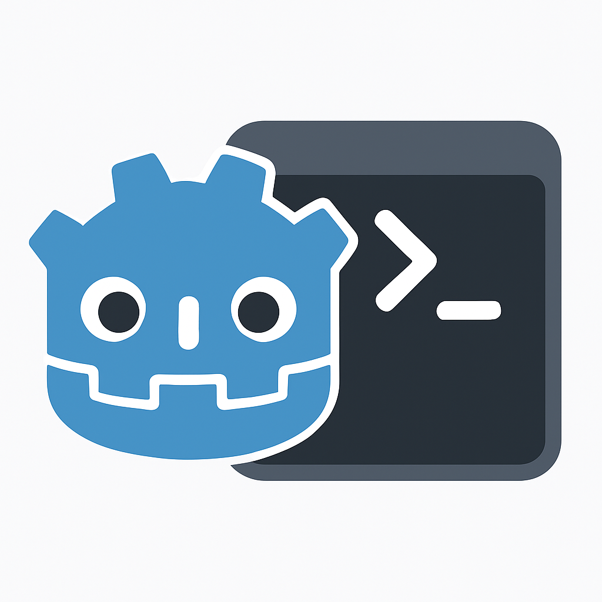

# Debug Console for Godot

<p align="center">
  
</p>

A powerful, feature-rich debug console addon for Godot 4.x (target: **4.5 / 4.6**) that provides an integrated terminal-like experience inside the Godot editor and at runtime.

**Current version:** v1.2.0 - Phase 4 + Wave 1 closed, 247/247 tests pass. See [What's New in v1.2.0](#whats-new-in-v120).

## Overview

The Debug Console transforms your Godot development workflow by providing a comprehensive command-line interface directly within the editor. It offers file management, project operations, debugging tools, and extensible command system - all accessible through an intuitive terminal-like interface.

## Features

### **Core Functionality**
- **Integrated Console** - Native bottom panel integration like Output/Debugger
- **Bash-style Prompt** - Echoed commands appear with a `dc:cwd $` prompt and BBCode-rendered banner on first open
- **Extensible Command System** - Register custom commands with help system, including a stable public `DebugConsole` autoload API for third-party plugins
- **Smart Autocomplete** - Context-aware suggestions (commands, files-only, directories-only, node paths) with a floating ItemList popup, Tab/Shift+Tab cycling, smart-prefix completion, and Esc dismissal
- **Command Piping** - Chain commands with `|` operator (e.g., `ls | grep .gd | wc`)
- **Context Awareness** - Different commands available in editor vs runtime, enforced by `Engine.is_editor_hint()`
- **Persistence** - Command history (capped at 500, consecutive-dedup) and per-project working directory survive editor restarts via `user://`

### **File Management**
- **File Operations** - `mkdir`, `touch`, `rm`, `rmdir`, `cp`, `mv`
- **Script Generation** - `new_script`, `new_scene`, `new_resource` with templates and fresh UIDs per call
- **Directory Navigation** - `cd`, `pwd`, `ls` (including `ls -l` table renderer), `tree` filesystem visualizer
- **Auto Refresh** - FileSystem dock updates automatically after operations
- **Clickable Paths** - Cyan file paths in console output open in the script editor on click

### **Development Tools**
- **Text Processing** - `grep`, `head`, `tail`, `find`, `wc`, `diff`, `cat`, `stat`, `json`
- **Project Control** - `save_scenes`, `run_project`, `stop_project`, `reload`, `reload_scripts`, `open`
- **Live Inspection** - `inspect`, `get`, `set`, `watch`, `signals`, `properties`, `scene_tree`
- **Productivity** - `alias`/`unalias` (persistent), `benchmark`, `config`, `save_log`
- **Testing Framework** - 247-test suite (`test`, `test_commands`, `test_autocomplete`, `test_files`, `test_pipes`, `quick_test`) with a file-based runner for headless CI

### **Runtime Features**
- **Game Console** - In-game debug console accessible via F12 or `Ctrl+\``
- **Performance Monitoring** - `fps`, `nodes` counts
- **Game Control** - `pause`, `timescale`, `opacity`
- **Print Interception** - `intercept on|off|status` routes engine `print()`/`push_warning()`/`push_error()` into the console (Godot 4.5+)
- **Resize Handle** - Drag the bottom edge of the game console to resize; Ctrl+Scroll adjusts opacity live

## Screenshots

> Add real captures here when convenient. Suggested shots:
>
> - `[screenshot of editor console with autocomplete popup open]`
> - `[screenshot of game console with intercepted print output]`
> - `[screenshot of `ls -l` table renderer]`
> - `[screenshot of `inspect` dump on an autoload]`

## Installation

### Method 1: Manual Installation
1. **Download** the addon files from this repository
2. **Copy** the `addons/debug_console` folder to your Godot project's `addons/` directory
3. **Enable** the addon in Project Settings → Plugins
4. The four autoloads (`DebugCore`, `CommandRegistry`, `DebugConsole`, `GameConsoleManager`) are registered automatically - no editor restart required

### Method 2: Git Submodule
```bash
cd your-godot-project
git submodule add https://github.com/your-username/debug-console.git addons/debug_console
```

### Requirements
- Godot **4.5** or **4.6** (GDScript or .NET / C# projects)
- The `intercept` runtime command requires Godot 4.5+ (the `Logger` class is not script-exposed before 4.5)

## Quick Start

### Editor Console
1. **Open Console** - Press ``Ctrl + ` `` or find "Debug Console" in the bottom panel
2. **Try Commands** - Start with `help` to see available commands
3. **Navigate** - Use `ls` to list files, `cd` to change directories
4. **Create Files** - Use `touch filename.txt` or `new_script MyScript`

### Game Console
1. **Run Project** - Start your Godot project
2. **Open Console** - Press `F12` to toggle the game console
3. **Debug** - Use `fps`, `nodes`, `pause` for runtime debugging

## Command Reference

The addon ships ~50 built-in commands. Run `help` to see the live list, or `help <command>` for the description of a single command.

### File Operations
```bash
ls [-l]               # List files (add -l for table: type, size, modified)
cd <directory>        # Change directory (cwd persists across editor restarts)
pwd                   # Show current directory
tree [depth]          # Visualize filesystem tree (default depth 3, cap 10)
mkdir <name>          # Create directory
touch <filename>      # Create file
cp <source> <dest>    # Copy file
mv <source> <dest>    # Move/rename file
rm <filename>         # Delete file
rmdir <directory>     # Remove directory
refresh               # Force-refresh the Godot FileSystem dock
```

### Content Creation
```bash
new_script <name> [extends_type] [class_name]    # Create script file with fresh UID
new_scene <name> [root_type]                     # Create scene file with fresh UID
new_resource <name> [resource_type]              # Create resource file
open <path>                                      # Open file in the script editor
node_types                                       # List Node classes available for `extends`
```

### Text Processing
```bash
cat <filename>        # View file contents (pipe-able input)
grep <pattern> [file] # Search for text patterns (pipe-able)
head [lines] [file]   # Show first N lines (pipe-able)
tail [lines] [file]   # Show last N lines (pipe-able)
find <pattern>        # Find files by name in cwd / subdirs
stat <filename>       # Show file size, type, modified time
wc [file]             # Lines/words/chars count (pipe-able)
diff <a> <b>          # Line-level BBCode-colored diff
json <text>           # Pretty-print JSON (pipe-able)
```

### Live Inspection & Property I/O
```bash
inspect <target>           # Dump every property of a node, autoload, or Engine
get <target>.<property>    # Read a live property
set <target>.<property> <value>  # Write a live property
watch <expr>               # Live-updating monitor (polls every ~0.5s)
scene_tree                 # Print scene graph as ASCII tree
signals <node_path>        # List signals on a node with connection counts
properties <node_path>     # Type-filtered property names (no values) from inspect
reload_scripts             # Force-reload every .gd file in the project
```

### Project Control (Editor)
```bash
scene                 # Show currently edited scene info
reload                # Reload current scene
save_scenes           # Save all open scenes
run_project [scene]   # Run main scene or specified scene
stop_project          # Stop currently running project
```

### Productivity & Persistence
```bash
alias <name>=<cmd>    # Create persistent alias (ConfigFile)
alias                 # List all aliases
unalias <name>        # Remove a persistent alias
benchmark [N] <cmd>   # Time command execution over N iterations
config <key> <value>  # Get/set persistent console preferences
save_log <path>       # Export the current session log to a file
```

### Console Management
```bash
clear                 # Clear console output
help [command]        # Show available commands or one command's help
history               # Show command history
clear_history         # Clear command history
echo <text>           # Print text to console (pipe-able)
```

### Testing
```bash
test                  # Run full 247-test suite
test_commands         # Test command system only
test_autocomplete     # Test autocomplete only
test_files            # Test file operations only
test_pipes            # Test command piping only
quick_test            # Run a fast subset
```

### Runtime Commands (Game Mode)
```bash
fps                   # Show current FPS
nodes                 # Count nodes in the scene tree
pause                 # Toggle game pause
timescale <value>     # Set engine time scale
opacity <0-100>       # Set console background opacity
intercept on|off|status  # Route engine print/warning/error into the console (Godot 4.5+)
```

## Keyboard Shortcuts

### Editor Console
| Shortcut | Action |
|----------|--------|
| ``Ctrl + ` `` | Toggle editor console panel |
| `Enter` | Execute command on the input line |
| `Tab` | Smart-prefix completion - first press inserts the longest common prefix, second press opens the suggestion popup |
| `Tab` (in popup) | Cycle to next suggestion (preview in input line) |
| `Shift + Tab` | Cycle to previous suggestion |
| `Esc` | Dismiss suggestion popup and restore the drafted input |
| `Up` / `Down` | Navigate persistent command history (capped at 500) |
| `Ctrl + R` | Reverse history search (bash-style) |
| `Ctrl + L` | Clear console output |
| `Ctrl + A` | Select all in the input line |
| `Ctrl + U` | Clear input line + dismiss popup |
| `Home` / `End` | Move caret to start / end of input |

### Game Console
| Shortcut | Action |
|----------|--------|
| `F12` | Toggle game console |
| ``Ctrl + ` `` | Also toggles game console |
| `Esc` | Close game console |
| `Ctrl + Scroll` (on console body) | Adjust opacity ±5% (floor 10%) |
| Drag bottom edge | Resize console height (clamped between 150px and 80% of viewport) |

## Architecture

### Project Structure
```
addons/debug_console/
├── core/
│   ├── CommandRegistry.gd      # Command registration, execution, piping engine
│   ├── BuiltInCommands.gd      # All ~50 built-in command implementations
│   ├── DebugCore.gd            # Core logging, history, output dispatch
│   ├── DebugConsoleAPI.gd      # Public `/root/DebugConsole` autoload API (Tier 4)
│   ├── ConsoleCommand.gd       # Declarative command Resource (Tier 4)
│   └── PersistenceManager.gd   # History + cwd persistence to user:// (Tier 3)
├── editor/
│   ├── EditorConsole.gd        # Editor console UI, autocomplete popup, table renderer
│   └── EditorConsole.tscn
├── game/
│   ├── GameConsole.gd          # Runtime console UI, opacity, resize handle
│   ├── GameConsole.tscn
│   ├── GameConsoleManager.gd   # Spawns GameConsole at runtime
│   └── GameConsoleLogger.gd    # print()/push_warning()/push_error() interceptor (Godot 4.5+)
├── tests/
│   ├── TestFramework.gd        # 247-test suite
│   └── README.md
├── icons/
│   └── console_icon.svg
├── plugin.gd                    # EditorPlugin entry point
└── plugin.cfg
```

### Autoloads (registered by the plugin)
```
/root/DebugCore             - logging, history
/root/CommandRegistry       - command registry + piping
/root/DebugConsole          - public plugin API (Tier 4)
/root/GameConsoleManager    - spawns GameConsole when the project runs
```

### Core Components

- **CommandRegistry** - Registration, execution, context enforcement, and pipe orchestration
- **BuiltInCommands** - Dependency-injected; receives `registry` and `core` refs, registers ~50 built-ins
- **DebugConsoleAPI** - Stable third-party surface: `register_command`, `unregister_command`, `print_to_console`, `has_command`, `list_commands`, `register_resource_command`, plus `command_executed` / `console_opened` / `console_closed` / `command_registered` / `command_unregistered` signals
- **EditorConsole** - Bottom-panel UI, BBCode output buffer (color-safe truncation), floating autocomplete popup, clickable file paths, `ls -l` table renderer
- **GameConsole** - Runtime overlay with opacity command, drag-resize handle, optional print interception
- **PersistenceManager** - JSON-backed `user://debug_console_history.json` (cap 500, consecutive-dedup) and per-project cwd in `user://debug_console_state.json`
- **TestFramework** - 247-test suite covering registry, built-ins, piping, autocomplete, UI, persistence, plugin API, performance, error handling, integration

## Development

### Public Plugin Author API

Third-party plugins can extend the console by talking to the `/root/DebugConsole` autoload (registered automatically when this addon is enabled). The surface is stable from v1.2.0 onward.

#### Imperative - `register_command` / `unregister_command`

```gdscript
# In your plugin's _enter_tree (or any later runtime path)
var dc: Node = get_node_or_null("/root/DebugConsole")
if dc:
    dc.register_command(
        "greet",                          # command word (lowercase, no spaces)
        Callable(self, "_run_greet"),     # any Callable returning a Stringable
        "Says hi to everyone listening",  # help text
        "both"                            # "editor" | "game" | "both"
    )

func _run_greet(args: Array) -> String:
    return "Hello %s" % (args[0] if args.size() > 0 else "world")

# Always unregister on cleanup so freed objects don't linger:
func _exit_tree() -> void:
    var dc: Node = get_node_or_null("/root/DebugConsole")
    if dc:
        dc.unregister_command("greet")
```

Other API methods on `DebugConsole`:

- `print_to_console(message: String, level: String = "info")` - write into the active console (`info`, `warning`, `error`)
- `has_command(command_name: String) -> bool`
- `list_commands() -> PackedStringArray` - sorted, includes built-ins and third-party
- `register_resource_command(cmd: Resource) -> bool` - register a `ConsoleCommand` instance

Signals on `DebugConsole`:

- `command_registered(command_name: String)`
- `command_unregistered(command_name: String)`
- `command_executed(command_name: String, args: Array, result: String)`
- `console_opened()`
- `console_closed()`

#### Declarative - `ConsoleCommand` Resource

```gdscript
var ConsoleCommandScript := load("res://addons/debug_console/core/ConsoleCommand.gd")

func _enter_tree() -> void:
    var dc: Node = get_node_or_null("/root/DebugConsole")
    if not dc:
        return
    var cmd: Resource = ConsoleCommandScript.new()
    cmd.command_name = "greet"
    cmd.description = "Says hi"
    cmd.context = "both"
    cmd.callable_target = self
    cmd.callable_method = "_run_greet"
    dc.register_resource_command(cmd)
```

`ConsoleCommand.callable_target` is intentionally not `@export`ed - Godot can't serialize `Object` refs on `Resource`, so commands are meant to be constructed in code, not loaded from `.tres`.

### Command Piping

Commands can be chained using the `|` operator:

```bash
ls | grep .gd                # List only .gd files
cat script.gd | grep func    # Find function definitions
find .gd | head 5            # Show first 5 .gd files
cat plugin.gd | wc           # Count lines/words/chars
```

Pipe-aware built-ins are marked `accepts_input = true` in the registry (`cat`, `grep`, `head`, `tail`, `wc`, `echo`, `json`, `ls`).

### Testing

The 247-test suite lives in `addons/debug_console/tests/TestFramework.gd`. There are two ways to run it:

```bash
# 1. Interactive: type into a console
test                  # full suite
test_commands         # registry only
test_autocomplete     # autocomplete only
test_files            # file ops only
test_pipes            # piping only
quick_test            # fast subset
```

```text
# 2. File-based runner (canonical, used by CI and orchestrator subagents):
# Run res://.dc_test_runner.tscn - it writes res://.dc_test_results.json
# with {ok, passed, failed, total, success_rate, failed_tests, error}
```

See [`addons/debug_console/tests/README.md`](addons/debug_console/tests/README.md) for the full testing guide.

## Contributing

We welcome contributions! Please see [CONTRIBUTING.md](CONTRIBUTING.md) for detailed guidelines.

### Quick Contribution Guide
1. **Fork** the repository
2. **Create** a feature branch
3. **Make changes** and add tests
4. **Run tests** to ensure 100% pass rate
5. **Submit** a pull request

## Testing

The Debug Console includes a comprehensive 247-test suite covering command registration, file operations, autocomplete, piping, persistence, the plugin author API, UI components, performance, and error handling.

Run `test` in the console to execute the full suite. The file-based runner at `res://.dc_test_runner.tscn` writes machine-readable results to `res://.dc_test_results.json` for CI use. See the [testing documentation](addons/debug_console/tests/README.md) for details.

## License

This project is licensed under the MIT License - see the [LICENSE](LICENSE) file for details.

## Support

### Getting Help
- **GitHub Issues** - Report bugs and request features
- **GitHub Discussions** - Ask questions and share ideas
- **Documentation** - Check code comments for implementation details

### Community
- **Discord** - Join our community server
- **Reddit** - r/godot for general Godot discussions
- **Godot Forums** - Official Godot community forums

## What's New in v1.2.0

v1.2.0 closes Phase 4 (Audit & Hardening) of the GSD roadmap - 4 tiers plus a Wave 1 polish pass. The test suite grew from 167 to **247 tests, all passing**.

- **Tier 1 - Correctness & test integrity.** Four surgical bugs squashed: cwd-clamping in autocomplete, silent `Esc` close in the game console, BBCode color loss on log truncation, focus theft from the script editor, and hardcoded UID collisions in `new_scene`. Removed an auto-PASS heuristic in the test runner and tightened OR-chain assertions that previously accepted failure as success.
- **Tier 2 - UX & keyboard polish.** Floating ItemList autocomplete popup with Tab/Shift+Tab cycling and Esc dismissal; Home/End/Ctrl+A/Ctrl+U input controls; colored output categories (cyan paths, yellow numbers, red errors, amber warnings); clickable file paths that open in the script editor; `ls -l` table renderer; game console gets `opacity`, drag-resize handle, and `intercept on|off|status` for routing engine `print()`/`push_warning()`/`push_error()` (Godot 4.5+).
- **Tier 3 - New commands & smart autocomplete.** New built-ins: `tree`, `wc`, `signals`, `properties`, `reload_scripts`, `diff`, `json`. Context-aware autocomplete: node-path suggestions after `inspect`/`get`/`set`/`watch`/`scene_tree`/`signals`/`properties`, directories-only after `cd`, files-only after `cat`/`grep`/`head`/`tail`/`stat`/`wc`/`diff`. Persistent history (500 cap, consecutive-dedup) and per-project cwd via `user://`.
- **Tier 4 - Public plugin author API.** Stable `/root/DebugConsole` autoload with `register_command`, `unregister_command`, `print_to_console`, `has_command`, `list_commands`, `register_resource_command`, plus `command_executed` / `console_opened` / `console_closed` / `command_registered` / `command_unregistered` signals. Declarative `ConsoleCommand` Resource type.
- **Wave 1 - Bash polish.** BBCode-rendered banner on first open, bash-style `dc:cwd $` prompt for echoed commands, Ctrl+R reverse history search, smart-prefix Tab completion (longest common prefix first, popup on second press), darker theme aligned with the editor's Dark theme.

## Changelog

### v1.2.0 (Current - 2026-05-27)
- Phase 4 + Wave 1 complete. Test suite: **247/247 PASS**.
- Tier 1: 4 bug fixes (B1 cwd autocomplete, B2 Esc close, B3a BBCode truncation, B3b focus theft, B4 UID collision). Test honesty: removed auto-PASS heuristic, tightened OR-chains, added regression tests.
- Tier 2: autocomplete popup + keyboard polish, colored output, clickable paths, table renderer, game console opacity / resize / print interception.
- Tier 3: `tree`, `wc`, `signals`, `properties`, `reload_scripts`, `diff`, `json` commands; context-aware autocomplete; persistent history and cwd.
- Tier 4: public `DebugConsole` plugin author API + `ConsoleCommand` Resource.
- Wave 1: banner, bash prompt, Ctrl+R, smart-prefix completion, dark theme.

### v1.1.0
- Phase 3b power tools: `inspect`, `get`/`set`, persistent `alias`/`unalias` (ConfigFile), `benchmark`, `config`.

### v1.0.1
- Fixed install-time parse errors (Issues #9, #10) caused by bare global identifiers in `@tool` scripts.

### v1.0.0
- Initial release: editor + runtime console, command registry, piping, autocomplete, file ops, content creation, project control, ~100-test suite.

## Acknowledgments

- **Godot Engine** - For the amazing game engine that makes this possible
- **Godot Community** - For inspiration and feedback
- **Contributors** - Everyone who has helped improve this addon

---

**Made with love for the Godot community**


