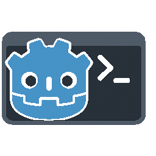

# Debug Console for Godot

<p align="center">
  
</p>

A powerful, feature-rich debug console addon for Godot 4.x that provides an integrated terminal-like experience within the Godot editor and runtime.

## Overview

The Debug Console transforms your Godot development workflow by providing a comprehensive command-line interface directly within the editor. It offers file management, project operations, debugging tools, and extensible command system - all accessible through an intuitive terminal-like interface.

## Features

### **Core Functionality**
- **Integrated Console** - Native bottom panel integration like Output/Debugger
- **Extensible Command System** - Register custom commands with help system
- **Smart Autocomplete** - Context-aware suggestions for commands, files, and node types
- **Command Piping** - Chain commands with `|` operator (e.g., `ls | grep .gd`)
- **Context Awareness** - Different commands available in editor vs runtime

### **File Management**
- **File Operations** - Create, copy, move, delete files and directories
- **Script Generation** - Generate scripts, scenes, and resources with templates
- **Directory Navigation** - Full filesystem navigation with `cd`, `pwd`, `ls`
- **Auto Refresh** - FileSystem dock updates automatically after operations

### **Development Tools**
- **Text Processing** - `grep`, `head`, `tail`, `find` for file content analysis
- **Project Control** - Save scenes, run/stop project
- **Debugging** - FPS monitoring, node counting, pause control
- **Testing Framework** - Comprehensive test suite with 100+ test cases

### **Runtime Features**
- **Game Console** - In-game debug console accessible via F12
- **Performance Monitoring** - Real-time FPS and performance metrics
- **Game Control** - Pause, timescale, and runtime debugging

## Screenshots

*[Screenshots will be added here]*

## Installation

### Method 1: Manual Installation
1. **Download** the addon files from this repository
2. **Copy** the `addons/debug_console` folder to your Godot project's `addons/` directory
3. **Enable** the addon in Project Settings → Plugins
4. **Restart** the Godot editor

### Method 2: Git Submodule
```bash
cd your-godot-project
git submodule add https://github.com/your-username/debug-console.git addons/debug_console
```

## Quick Start

### Editor Console
1. **Open Console** - Press ``Ctrl + ` `` or find "Debug Console" in the bottom panel
2. **Try Commands** - Start with `help` to see available commands
3. **Navigate** - Use `ls` to list files, `cd` to change directories
4. **Create Files** - Use `touch filename.txt` or `new_script MyScript`

### Game Console
1. **Run Project** - Start your Godot project
2. **Open Console** - Press `F12` to toggle the game console
3. **Debug** - Use `fps`, `nodes`, `pause` for runtime debugging

## Command Reference

### File Operations
```bash
ls                    # List files in current directory
cd <directory>        # Change directory
pwd                   # Show current directory
mkdir <name>          # Create directory
touch <filename>      # Create file
cp <source> <dest>    # Copy file
mv <source> <dest>    # Move/rename file
rm <filename>         # Delete file
rmdir <directory>     # Remove directory
```

### Content Creation
```bash
new_script <name> [extends_type] [class_name]    # Create script file
new_scene <name> [root_type]                     # Create scene file
new_resource <name> [resource_type]              # Create resource file
```

### Text Processing
```bash
cat <filename>        # View file contents
grep <pattern> [file] # Search for text patterns
head [lines] [file]   # Show first N lines
tail [lines] [file]   # Show last N lines
find <pattern>        # Find files by name
stat <filename>       # Show file information
```

### Project Control
```bash
save_scenes           # Save all open scenes
run_project [scene]   # Run main scene or specified scene
stop_project          # Stop currently running project
```

### Console Management
```bash
clear                 # Clear console output
help [command]        # Show available commands or command help
history               # Show command history
echo <text>           # Print text to console
```

### Testing
```bash
test                  # Run comprehensive test suite
test_commands         # Test command system
test_autocomplete     # Test autocomplete functionality
test_files            # Test file operations
test_pipes            # Test command piping
```

### Runtime Commands (Game Mode)
```bash
fps                   # Show current FPS
nodes                 # Count nodes in scene tree
pause                 # Toggle game pause
timescale <value>     # Set game time scale
```

## Keyboard Shortcuts

| Shortcut | Action |
|----------|--------|
| ``Ctrl + ` `` | Toggle editor console |
| `F12` | Toggle game console |
| `Enter` | Execute command |
| `Tab` | Autocomplete |
| `Up/Down` | Navigate command history |
| `Ctrl + L` | Clear console |

## Architecture

### Project Structure
```
addons/debug_console/
├── core/
│   ├── CommandRegistry.gd    # Command registration and execution
│   ├── BuiltInCommands.gd    # Built-in command implementations
│   └── DebugCore.gd          # Core logging and initialization
├── editor/
│   ├── EditorConsole.gd      # Editor console UI and logic
│   └── EditorConsole.tscn    # Editor console scene
├── game/
│   ├── GameConsole.gd        # Runtime console UI
│   ├── GameConsole.tscn      # Game console scene
│   └── GameConsoleManager.gd # Runtime console management
├── tests/
│   └── TestFramework.gd      # Comprehensive test suite
├── icons/
│   └── console_icon.svg      # Console icon
└── plugin.gd                 # Main plugin entry point
```

### Core Components

- **CommandRegistry** - Manages command registration, execution, and piping
- **BuiltInCommands** - Implements all built-in commands with context awareness
- **EditorConsole** - Editor-specific UI with autocomplete and file integration
- **GameConsole** - Runtime console with performance monitoring
- **TestFramework** - 100+ test cases covering all functionality

## Development

### Adding Custom Commands

```gdscript
# Register a new command
CommandRegistry.register_command(
    "my_command",           # Command name
    _my_command_function,    # Function to call
    "Description",          # Help text
    "editor"               # Context (editor/game/both)
)

# Implement the command function
func _my_command_function(args: Array) -> String:
    return "Command executed successfully"
```

### Command Piping

Commands can be chained using the `|` operator:

```bash
ls | grep .gd              # List only .gd files
cat script.gd | grep func  # Find function definitions
find .gd | head 5          # Show first 5 .gd files
```

### Testing

The addon includes a comprehensive test suite with 100+ test cases:

```bash
# Run all tests
test

# Run specific test categories
test_commands
test_autocomplete
test_files
test_pipes
```

## Contributing

We welcome contributions! Please see [CONTRIBUTING.md](CONTRIBUTING.md) for detailed guidelines.

### Quick Contribution Guide
1. **Fork** the repository
2. **Create** a feature branch
3. **Make changes** and add tests
4. **Run tests** to ensure 100% pass rate
5. **Submit** a pull request

## Testing

The Debug Console includes a comprehensive test suite with over 100 test cases covering command registration, file operations, autocomplete, piping, UI components, performance, and error handling.

Run `test` in the console to execute the full test suite. See the [testing documentation](addons/debug_console/tests/README.md) for detailed information.

## License

This project is licensed under the MIT License - see the [LICENSE](LICENSE) file for details.

## Support

### Getting Help
- **GitHub Issues** - Report bugs and request features
- **GitHub Discussions** - Ask questions and share ideas
- **Documentation** - Check code comments for implementation details

### Community
- **Discord** - Join our community server
- **Reddit** - r/godot for general Godot discussions
- **Godot Forums** - Official Godot community forums

## Changelog

### v1.0.0 (Current)
- Initial release with comprehensive feature set
- Full file management capabilities
- Extensible command system
- Comprehensive test suite (100+ tests)
- Editor and runtime console support
- Command piping functionality
- Context-aware commands (editor vs game)
- Smart autocomplete system

## Acknowledgments

- **Godot Engine** - For the amazing game engine that makes this possible
- **Godot Community** - For inspiration and feedback
- **Contributors** - Everyone who has helped improve this addon

---

**Made with love for the Godot community**


